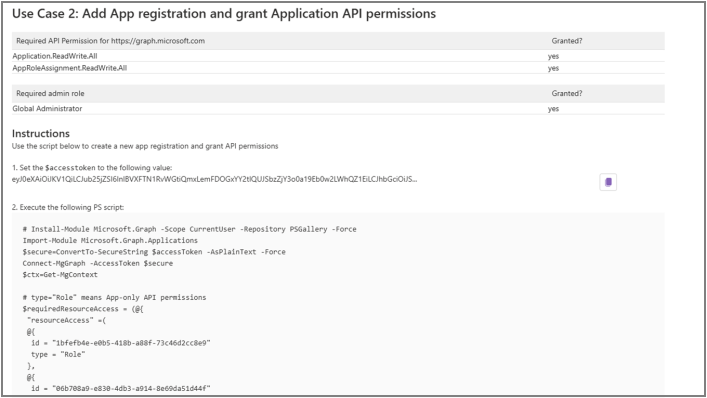

# SharePoint Framework Extortion Pack

## What does it take to steal your teanant? Not much. And your data? Even less.

It's unfortunately a common **misconception** that SharePoint extensions are "safe by design"
and that granting "delegated permissions only" keeps your tenant secure.

If this is your case, I wrote this **Extortion Pack** just for you! 😊

If you are a SharePoint Admin, Global Admin, or even a Site Owner who's been trusted with a Site-level app catalog,
you are the only person standing between your data and the hacker. You don't want to be the one who let them in.

SPFx solutions may only request delegated permissions but it doesn't make them "safe by design". If you thought it does, you are exposing your organization to significant security risks.

Hckers may use SPFx solutions to **EASILY steal your data** or replace links with **spoofing URLs** without any additional permissions granted. They may also **exploit Access Tokens** to access your tenant remotely, to steal data without relying on users keeping the SharePoint page open, and **potentially take over the entire tenant**.

## Best case: your data gets stolen. Worst case: you lose your entire tenant.

Let me explain.

SPFx solutions and **any code running within you SharePoint Online sites** have access to **all the SharePoint content on the current user's behalf** and can access **external APIs** to send this information outside of your company.

**No additional permissions needed, no way to block it**.

Siphoning your company's data stored in SharePoint can only be avoided by not installing the malicious code.

And if the app requests permissions? _"All permissions are granted to the whole tenant and not to a specific application that has requested them."_ See [Connect to Azure AD-secured APIs in SharePoint Framework solutions](https://learn.microsoft.com/en-us/sharepoint/dev/spfx/use-aadhttpclient#:~:text=All%20permissions%20are%20granted%20to%20the%20whole%20tenant%20and%20not%20to%20a%20specific%20application%20that%20has%20requested%20them).

It means that any permissions requested by apps, once approved, are **granted not to the app that requested them**, but to **all the code** running in your SharePoint Online site: SharePoint Framework solutions, JavaScript code in script editor, or even JavaScript code executed in browser's console.


This means the code acting on behalf of a current user: you, your colleagues, your CISO or CEO.

## But wait, it gets worse

The code running within your SharePoint Online site is using [Access Tokens](https://pnp.github.io/blog/post/introduction-to-tokens/) when accessing information. They are saved in your browser's local storage, and you can see them using the DevTools Application tab (F12 to open).

The code may easily generate fresh Access Tokens and send them outside of your tenant to be used remotely.


Bad actor only needs to:

-   read your current access token to understand what privileged roles you have and what actions may be executed on your behalf
-   generate new Access Token
-   send it to their own endpoint
-   use it within one hour

Depending on what (delegated) permissions were previously approved in your tenant, and what privileged role your signed-in user has, the hacker may now:

-   spend the next hour stealing your data and replacing links within your SPO sites, or
-   create new app registration and grant App-only permissions to be used by their own code from now on, or
-   take over your tenant 👈

## Delegated permissions

I'm not saying there is something wrong with delegated permissions. [App-only and delegated](https://learn.microsoft.com/en-us/entra/identity-platform/permissions-consent-overview) permissions are **different tools for different jobs** and it is your responsibility to understand how to use them appropriately.

But if you assume that granting only delegated permissions will keep your tenant secure, you're up to rude awakening.

## If I was a hacker

If I was a hacker I would build a solution consisting of:

-   a Web Part that engages users in some way... a table of contents for a page, or a dashboard
-   an Application Customizer that does all the naughty things

> Application Customizers don't have to render anything to the UI, and unlike WebParts, they are not displayed on the Page even in edit mode. They may only be detected via code.

Maybe you won't deploy my solution to the whole tenant. No problem.

Once added to a page, the Web Part would associate the Application Customizer with all the sites you are an Owner of. The Application Customizer would then do the same for any other user accessing infected sites. It would spread like a virus.


Soon all the SharePoint online sites in your environment will be infected.

## Would you let a stranger into your own home, just to see what happens?

It's practically impossible to make a code reviews of a SPFx solutions.

You may consider checking the traffic generated by the solutions you install, using Network tab in DevTools. Maybe it will help you, maybe it won't.

To avoid detection, I would first check if this is your productive tenant (domain name, number of users) or simply grant a grace period to allow you to test and approve the solution before executing the malicious code.

And if I saw you are a Global Admin and the `User.ReadWrite.All` plus `RoleManagement.ReadWrite.Directory` permissions have been granted, I wouldn't waste my time. I would send your Access Token to my own endpoint and use it immediately to take over your tenant.

**If you see your access token being stolen it's already too late.**

## Don't underestimate the severity of the problem.

Your red lines should be:

-   granting API permissions that allow creating service principals and registrations or users and
-   accessing any SharePoint Online site using roles with elevated privileges

Delegated permissions-only approach will not protect you. Only install solutions that you really need and that come from legitimate source. It means nothing, that a website looks good. It's a piece of cake to generate a perfect copy of existing site. Do you know the company? Is it really their own website? Is that MVP's domain name misspelled?

And if you allow site-level app catalog in your company, make sure the Site Owners understand the risks and consent to regular reviews of extensions they install. **Don't expect your users to care about security if you don't.**

## Still don't believe me?

One ~~image~~ WebPart is worth a thousand words.
I wrote two, each of them presenting another vector of attack.

### Data Exfiltration

The "Data Exfiltration" WebPart calls only one endpoint, "https://httpbin.org/post", to ensure that calling external APIs is not blocked.

To enable additional buttons in the SharePoint REST API tab, allowing you to send the contents of a selected site to your "external endpoint", provide the URL and subscription key of your API Management service in Azure in WebPart properties. You may use it to test tracking of [SPO traffic in Application Insights](https://adoption.microsoft.com/en-us/sample-solution-gallery/sample/pnp-sp-dev-spfx-web-parts-js-applicationinsights-api-calls-tracking/), or see if any alerts are triggered in [Defender for Cloud Apps](https://learn.microsoft.com/en-us/defender-cloud-apps/tutorial-proxy).

The WebPart provides information explaining risks related to malicious code accessing some of the available APIs,


and a summary of evaluated API permissions.


If configured, it allows you to send site contents to your APIM service in Azure.


### Get Access Tokens

The "Get Access Tokens" WebPart does not send any information to external APIs.

It simply displays new access token generated for different scopes (https://graph.microsoft.com and https://management.azure.com), along with instructions on how to execute attacks.

It displays some of your admin roles, if any, and checks if conditions are met to execute different attacks.


For each use case, you see whether required API permissions are granted in your tenant. Copy the Access Token and follow the instructions using PowerShell terminal on your own computer. This allows you to simulate the attack that would be executed remotely by a hacker.

Use case 1: tenant takeover


Use case 2: App registration with App-only API permissions


Use case 3: Access Azure resources


### The "Extortion Pack" solution

This solution does not request any API permissions, instead relying on those already granted. This is a type of an app you would install no questions asked, right?

It's possible that not all actions may be executed. Perhaps the "Data exfiltration" WebPart won't be able to read your emails? Or maybe the "Get Access Token" will be useless because you were cautious when granting API permissions? I sure hope so.

You may still install it in your development tenant, grant extra API permissions to the "**SharePoint Online Client Extensibility Web Application Principal**" and see what happens.

**These WebParts are not malicious**. They will not make any changes to your tenant, exfiltrate your data or steal access tokens.

You can download both WebParts from my [GitHub](https://github.com/kkazala/Extortion-Pack) repo, [Releases](https://github.com/kkazala/Extortion-Pack/releases) section.

> I hope this gave you a pause...
> Is it safe? Do you even know me? Can you trust me?

**Choose your own adventure.** The source code is available; you may review it and build your own package by following these instructions: [Prepare web part assets to deploy](https://learn.microsoft.com/en-us/sharepoint/dev/spfx/web-parts/get-started/hosting-webpart-from-office-365-cdn#prepare-web-part-assets-to-deploy).

## Popular misconceptions

### "We grant delegated permissions only"

The governance is often based on (and limited to) granting SPFx solutions delegated permissions only. As great as it sounds, it proves lack of understanding of security model, because SPFx solutions may only request delegated permissions.

And although these permissions ensure the user may only see resources they have access to, it won't stop malicious code from stealing data from your company, because **there's no way to stop SPFx apps from calling external API** .

### "Until you approve the required permissions the solution won't work the way it's supposed to."

There's a common (and false) belief that permissions granted to a SPFx solution apply to this specific solution only, and until the request is approved, the app will not function properly.

In fact, API permissions are shared across all SPFx solutions that ever have, and will be, installed.

It is a good practice to fail your code gracefully, should the required permissions be missing. But your solution doesn't have to request any permissions to be able to use them.

### "It's not so easy to steal a token"

Well... from within the SPFx solution? It is very easy indeed.

It's two lines of code using MSAL library, and the token is valid 1 hour (90 minutes, to be exact). It's more than enough time to do some damage.

```powershell
public static async GetAccessToken_MSGraph(context: WebPartContext): Promise<string> {
	const tokenProvider = await context.aadTokenProviderFactory.getTokenProvider();
	return await tokenProvider.getToken("https://graph.microsoft.com");
}
```

## The false sense of security

SharePoint and SharePoint extensions have been around for so long that, unlike newer technologies like Copilot extensions, they are rarely perceived as potential security threats.

Typically, most solution architects and developers understand the full extent of potential damage, but they are focused on building safe and reliable solutions, not exploiting them.

On the other hand, the teams responsible for governance such as Global Administrators or SharePoint Administrators, often lack deep understanding of the security model behind SPFx extensions. They may be under impression that SPFx solutions are "secure by design" and offer them full control over what is happening in their tenant.

This false sense of security and a belief that SPFx apps are secure by design may result in lack of scrutiny of SPFx extensions installed in the tenant. The threat seems to be **hiding in plain sight**.

The UI of the "API access" site shows which extension requested which permissions, leading admins to believe they are granting permissions to this specific extension. I already heard that "we only need to find out which extension is granted which permissions".

The official documentation is also not very forthcoming.
The [Manage apps using the Apps site](https://learn.microsoft.com/en-us/sharepoint/use-app-catalog) linked from the "Manage apps" does not mention approving permissions at all. The [Manage access to Microsoft Entra ID-secured APIs](https://learn.microsoft.com/en-us/sharepoint/api-access) does, however, explain that:

> Permissions of type delegated are added to the SharePoint Online Client Extensibility Web Application Principal in Microsoft Entra ID.
>
> If you try to approve a permission request for a resource that already has some permissions granted (for example, granting additional permissions to the Microsoft Graph), the requested scopes are added to the previously granted permissions.

**Finally! It is now clear that all SPFx extensions, along with any JavaScript client-side injected into the page or executed from the console, and any code executed remotely that has your Access Token, share the same permissions. ...Right?**

I think we could all benefit from more direct explanations in the documentation, and maybe some warnings displayed in the Admin portal when approving API permissions.

And in the meantime, let's spread the news. Pretending that all is great benefits only hackers.
